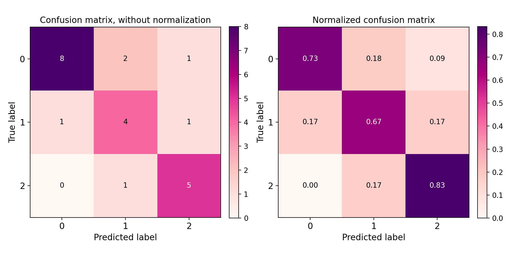

[](https://www.fontspace.com/category/fancy)

--------------------------------------


**MLVizLib (Machine Learning Visualization Library)** is a powerful
library for generating quick, insightful, and stylish visualizations for
machine learning (ML). Our goal is to enhance the ML workflow by
providing insightful visualizations with minimum effort.

-   Documentation: (COMING SOON) <https://mlvizlib.readthedocs.io>.

> **NOTE**
>
> This project is in early stage development, and can thus go trough major changes.

Install
-------

MLVizLib can be installed from
[PyPI](https://pypi.org/project/mlvizlib/):

``` {.sourceCode .python}
pip install mlvizlib
```

Features
--------

-   Confusion Matrix Visualization

> **note**
>
> More coming soon.

Confusion Matrix Visualization example
--------------------------------------

``` {.sourceCode .python}
import matplotlib.pyplot as plt
from mlvizlib.classification import confusion_matrix

# example data
eg_y_true = [2,0,1,0,2,0,1,2,0,0,2,0,1,1,0,1,1,0,0,0,0,2,2]
eg_y_pred = [2,0,0,0,2,0,1,2,1,0,2,2,1,1,0,2,1,0,1,0,0,1,2]

confusion_matrix(eg_y_true, eg_y_pred)
plt.show()
```
<p align="center">
  
</p>


